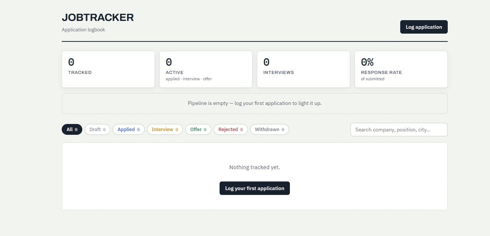

# JobTracker

A job application tracker built as a full-stack portfolio project:

- **Backend** — .NET 10 (LTS), ASP.NET Core **gRPC** (no REST), EF Core, **PostgreSQL**
- **Frontend** — React 19 + TypeScript, **TanStack Query** (server state), **Zustand** (UI state), Vite
- **Contract** — a single `.proto` file drives both the C# server stubs and the TypeScript client (via [buf](https://buf.build) + Connect-ES over **gRPC-Web**)

## Screenshot



```
JobTracker/
├── JobTracker.sln
├── docker-compose.yml          # Full stack: PostgreSQL, Backend, Frontend
├── src/JobTracker.Api/         # gRPC service
│   ├── Protos/job_tracker.proto    # ← single source of truth for the API
│   ├── Services/JobApplicationGrpcService.cs
│   ├── Data/JobTrackerDbContext.cs
│   ├── Models/JobApplication.cs
│   └── Mapping/ProtoMapper.cs
└── frontend/                   # Vite + React + TS
    ├── buf.gen.yaml                # codegen config (proto → TS)
    └── src/
        ├── gen/job_tracker_pb.ts   # generated client + types (committed)
        ├── api/client.ts           # Connect-ES gRPC-Web client
        ├── api/queries.ts          # TanStack Query hooks
        └── store/useUiStore.ts     # Zustand (filters + modal only)
```

## Prerequisites

- [.NET 10 SDK](https://dotnet.microsoft.com/download/dotnet/10.0)
- Node.js 20+
- Docker Desktop

## Quick start

### Full Stack (Docker)

```bash
docker compose up -d
```

This starts:
- **PostgreSQL 17** on `localhost:5432`
- **Backend** (ASP.NET Core gRPC) on `http://localhost:5000`
- **Frontend** (React + Vite) on `http://localhost:5173`
- **pgAdmin** on `http://localhost:5050` (for database management)

Open `http://localhost:5173` to access the app.

### Local Development (Backend + Frontend)

For faster development iteration, run only the database in Docker and backend/frontend locally:

#### 1. Start database and pgAdmin

```bash
docker compose -f docker-compose.db.yml up -d
```

This starts PostgreSQL on `localhost:5432` and pgAdmin on `localhost:5050`.

#### 2. Backend (first run)

```bash
cd src/JobTracker.Api

# one-time: EF Core CLI + initial migration
dotnet tool install --global dotnet-ef
dotnet ef migrations add InitialCreate

dotnet run
```

The API listens on `http://localhost:5000`. Pending migrations are applied
automatically on startup in Development, so after the migration exists you can
just hit Run in Rider.

#### 3. Frontend

```bash
cd frontend
npm install
npm run dev
```

Open `http://localhost:5173`.

> After changing `job_tracker.proto`, regenerate the TypeScript client with
> `npm run generate` (the C# side regenerates automatically on build).

## Code Quality

### Analyzers & Style Enforcement

- **Roslynator** (300+ code analysis rules)
- **EditorConfig** (.NET code style standards)
- **Enabled in build** — violations prevent compilation (`EnforceCodeStyleInBuild`)

Analyzers run automatically in your IDE (VS Code, Rider, Visual Studio) and during `dotnet build`.

To fix style violations automatically:

```bash
dotnet format
```

---

## Architecture notes (interview talking points)

- **Why gRPC-Web?** Browsers can't speak native gRPC (no control over HTTP/2
  framing), so the server enables the `Grpc.AspNetCore.Web` middleware and the
  client uses Connect-ES's `createGrpcWebTransport`. Unary calls work over
  HTTP/1.1; CORS must expose the `Grpc-Status`/`Grpc-Message` trailers.
- **Contract-first:** the proto file is the API. Backend stubs are generated by
  `Grpc.Tools` at build time; frontend types by `buf` + `protoc-gen-es`. There
  is no hand-written DTO layer to drift out of sync.
- **State split:** TanStack Query owns everything the server owns (lists,
  stats, caching, invalidation after mutations). Zustand holds only true UI
  state — active filter, search text, modal open/editing. No server data is
  ever copied into the store.
- **PostgreSQL specifics:** case-insensitive search uses `EF.Functions.ILike`
  (Npgsql provider), the status enum is stored as text for readability, and
  timestamps are `timestamptz` (UTC enforced at the mapping boundary).
- **Validation at the edge:** the gRPC service throws `RpcException` with
  `InvalidArgument`/`NotFound`; the Connect client surfaces these as typed
  `ConnectError`s that the form displays.

## Production Deployment

Deploy to Azure with Infrastructure as Code (Bicep):

```bash
./deploy.sh prod westus
```

**Stack:**

- Static Web Apps (frontend) — FREE
- Container Instances (backend) — ~$10-15/mo
- PostgreSQL Flexible Server — ~$15-25/mo

**Total: ~$30/month**

See [DEPLOYMENT.md](./DEPLOYMENT.md) for detailed setup, monitoring, and scaling.

---

## Roadmap ideas

- Status history table → time-in-stage analytics
- Auth (OpenID Connect) for multi-user use
- Server-streaming RPC pushing live updates to the dashboard
- Document storage per application (CV/cover letter versions)
